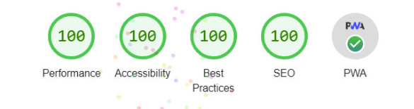

# **Salary-Calc**: https://www.salarycalc.ru

## О Проекте:

Сайт для составления рабочего табеля и расчета зарплаты. В идее заложен авто-обновляемый календарь, с актуальными российскими праздничными днями. При клике на каждый день есть возможность проставить свою активность (обычные работы, либо работы на монтаже, отпуск, простои и тд..) с указанием кол-ва часов переработки. Сайт работает как онлайн так и офлайн приложение.
## Стек технологий:

- React
- TypeScript 
- Redux-toolkit
- Redux-persist
- Dayjs
- Styled-Components
- Service Worker

## Рейтинг LightHouse:

Особое внимание уделил доступности =)

